## Java技术小馆是做什么的？

​	你是否在寻找一个涵盖广泛的Java编程资源，以及为你的技术之旅提供持续支持的地方？那么，恭喜你，你已经来到了合适的地方！"toString技术小馆"不仅是一个知识宝库，更是一个致力于为你打造全面、深入且充满趣味的学习环境。

​	在 "技术小馆"，我们坚信学习编程不仅可以是严肃的，更可以是愉快的探索之旅。我们汇聚了Java编程领域的各个方面，将知识变成了一场既有深度又有趣味的冒险。无论你是初学者还是有经验的开发者，我们都有适合你的内容，让你在这里找到成就感与乐趣。

   截止2024年1月统计，技术小馆创作**473**天，共**1662万**字。

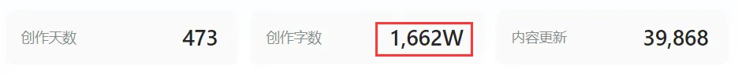

## 技术小馆目录

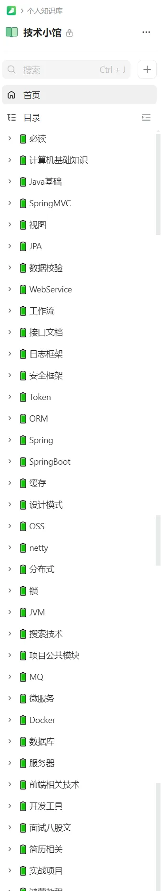

## 技术小馆部分内容展示

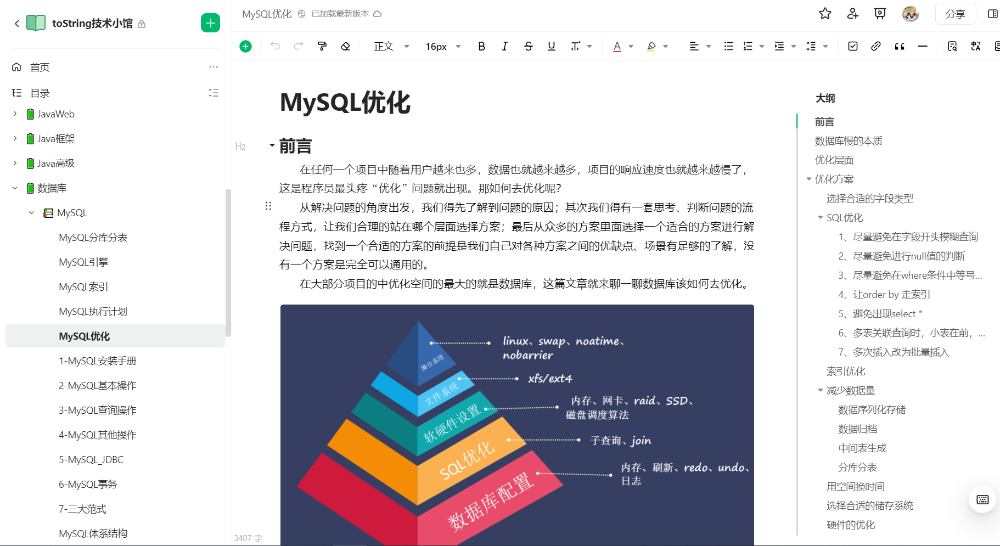

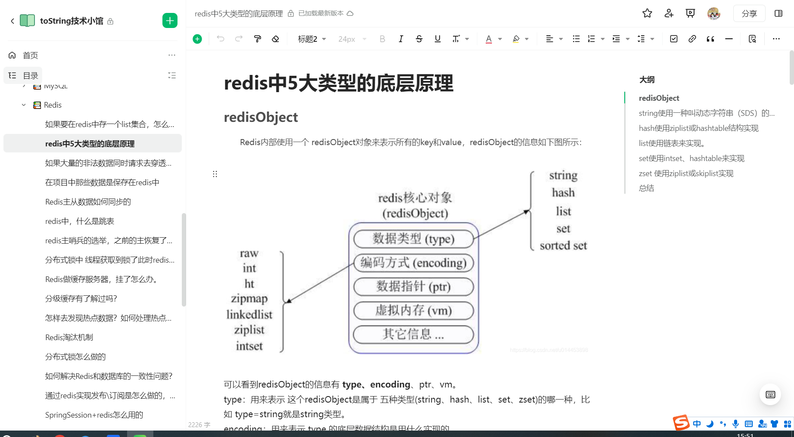

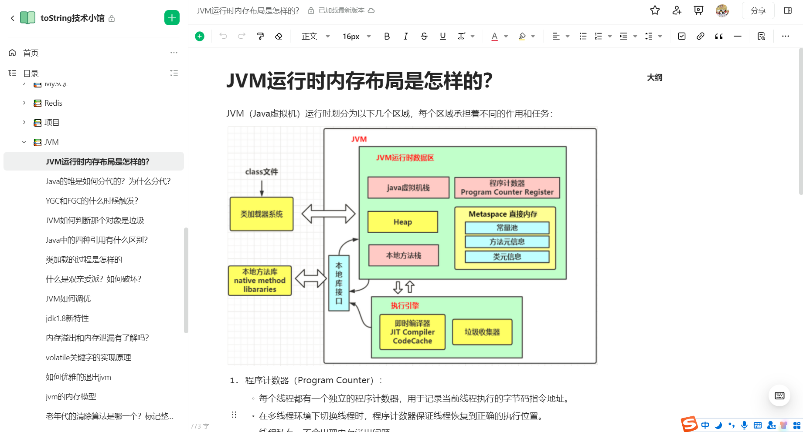

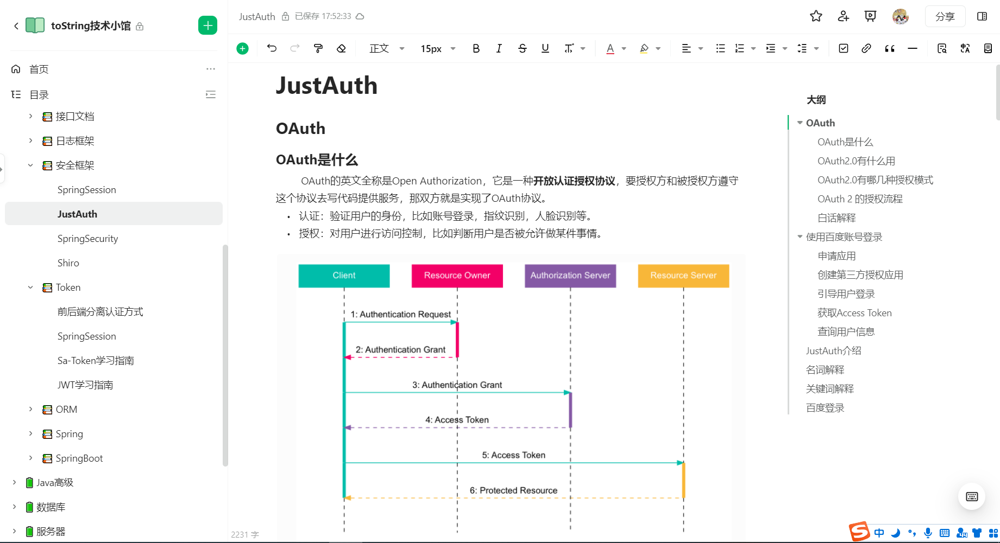

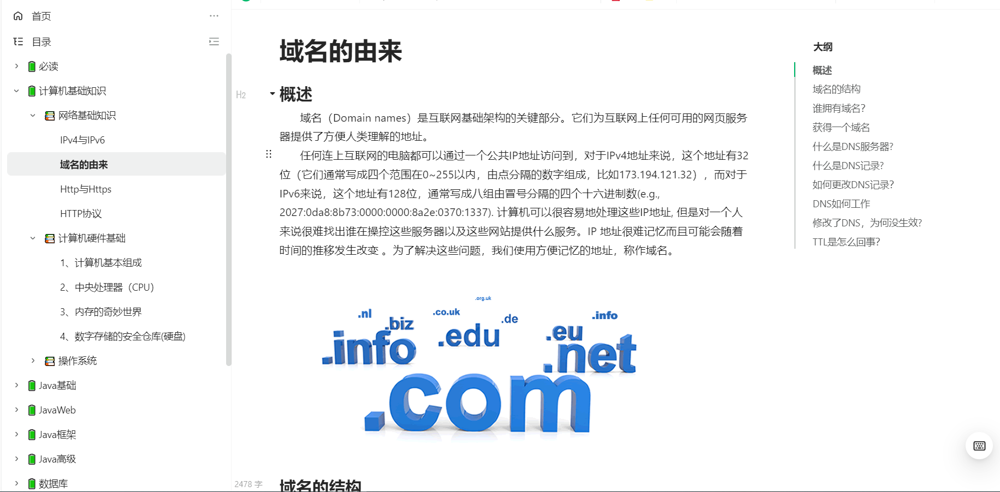

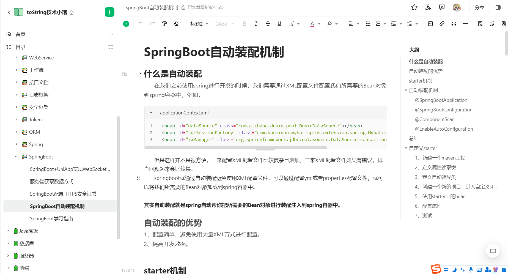

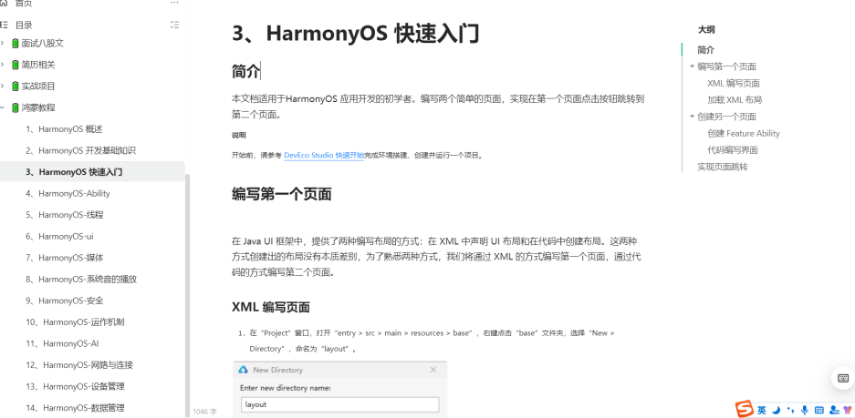

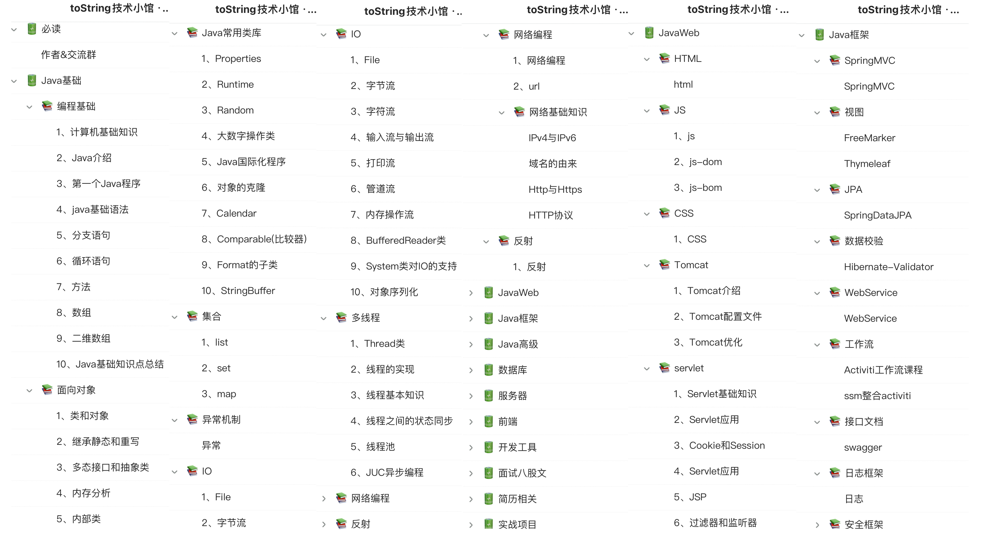

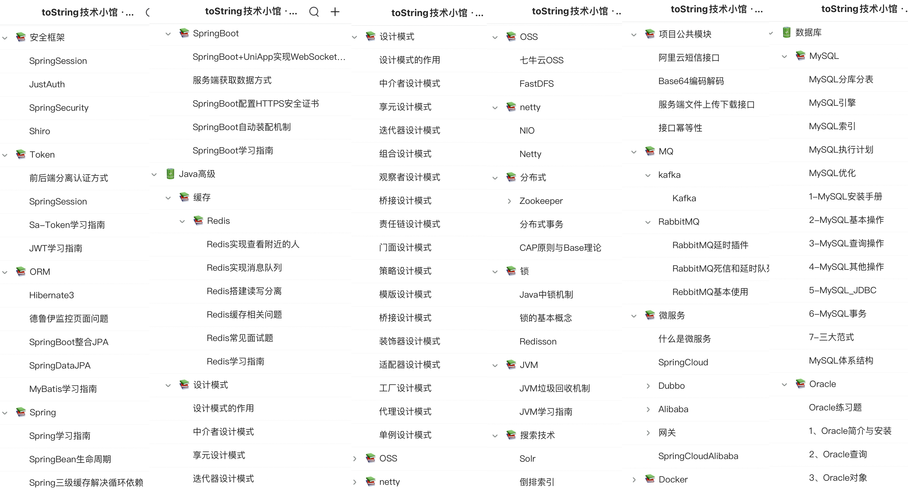

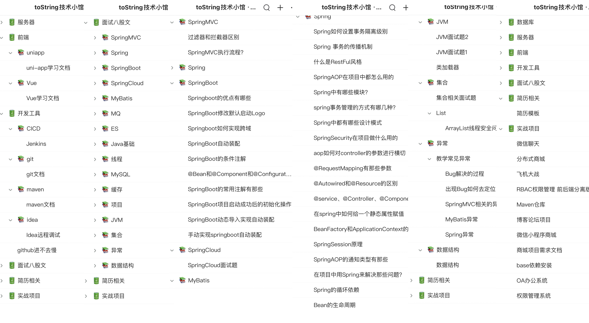

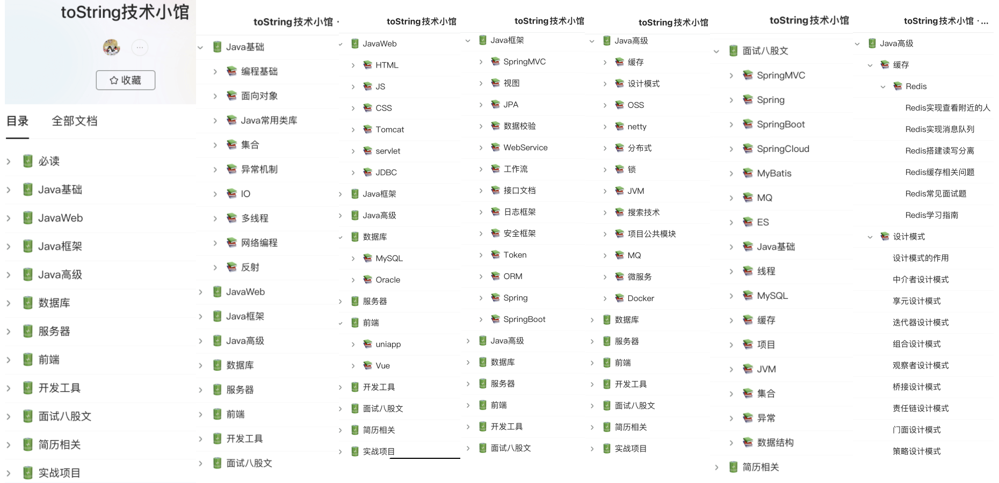

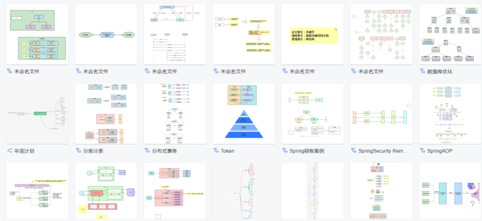

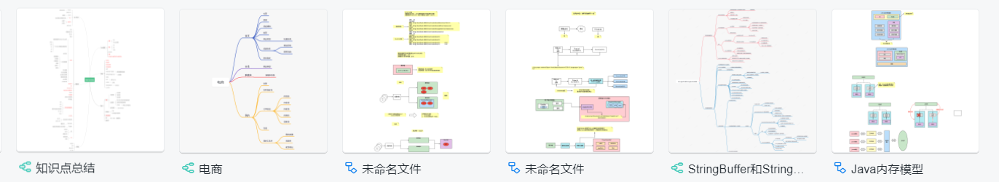

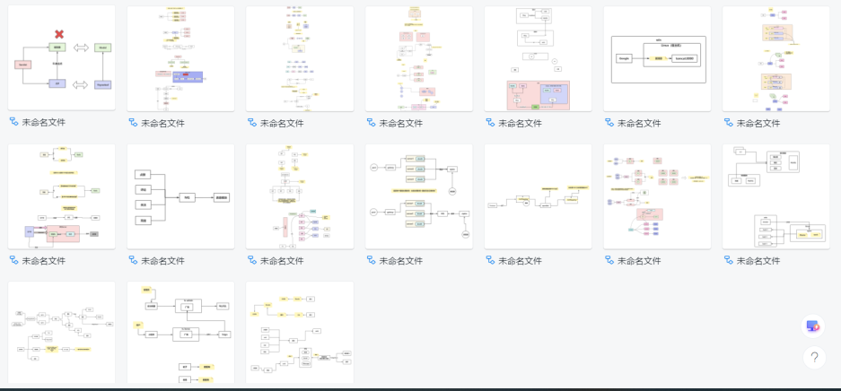

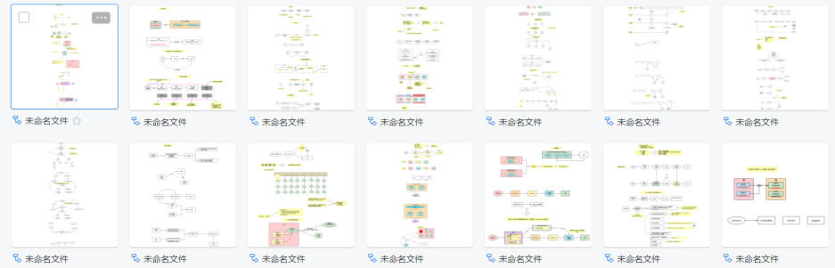

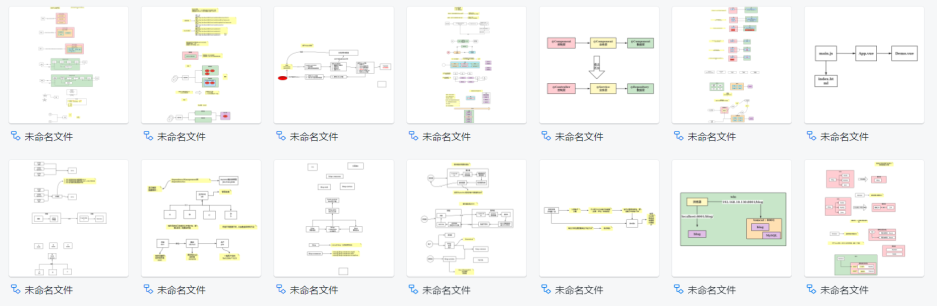

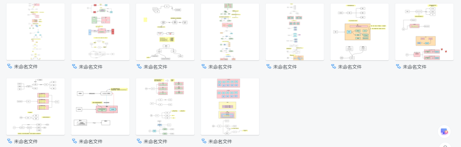

## 实战项目

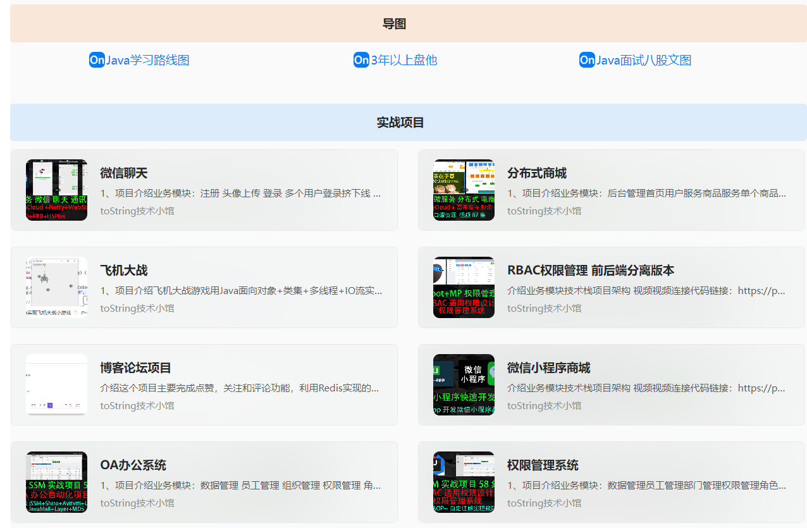	

Java2024学习路线：https://www.processon.com/view/link/64e5891b5adbb0271b27a443

3年以上盘他：https://www.processon.com/view/link/64e71adbb08bb5658e76e5b4

Java面试八股文(能回答70%找工作问题不大)：https://www.processon.com/view/link/6391dd1751757068e722c3f1

## 看看读者怎么说

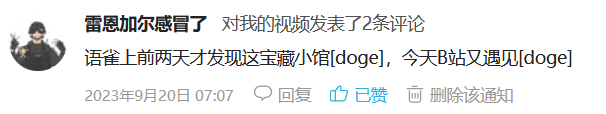

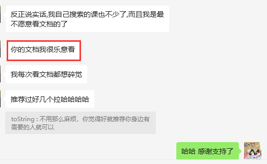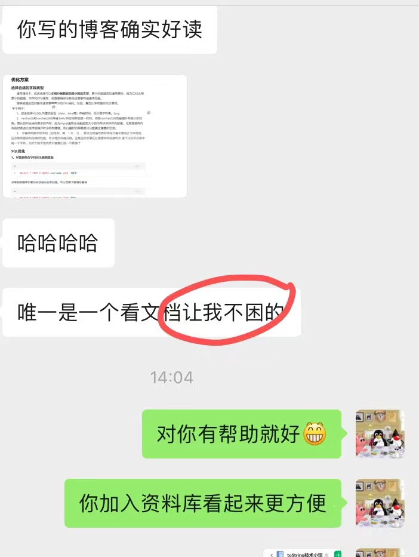

## 如何加入我们

**说明**：技术小馆是付费的，但是价格绝对物有所值

1.  时常，免费所带来的代价远大于所付出的。在寻找免费资源的过程中，我们可能浪费了宝贵的时间，走了弯路，还要应对繁琐的广告和营销信息。而采用轻度付费方式，可以以更放心的心态，享受到有价值的内容，省去不必要的困扰，同时也是对自己和他人的一种投资。 
2.  单独探索坑坑洼洼，往往不如携手前行，尤其是有博主引路的情况下。有了博主的指引，我们不会迷失在学习的方向中。在共同前进的道路上，我们能够互相学习，共同成长，减少冒险，更加坚定前行的方向。 
3.  不再被人际关系所困扰，也不必担心同事的情绪问题。不管问题大小，我们都可以在社群中公开或私下得到解答，确保每一个问题都能得到用心回答。每天都有答案，每个人都得到关注。 
4.  轻度的付费让我们为提供的服务付出，也得到了积极的回应。这种正向的激励能够更好地激发我们为大家提供更优质的服务，互利共赢，实现更好的成长。 

**扫描二维码加入我们！**

